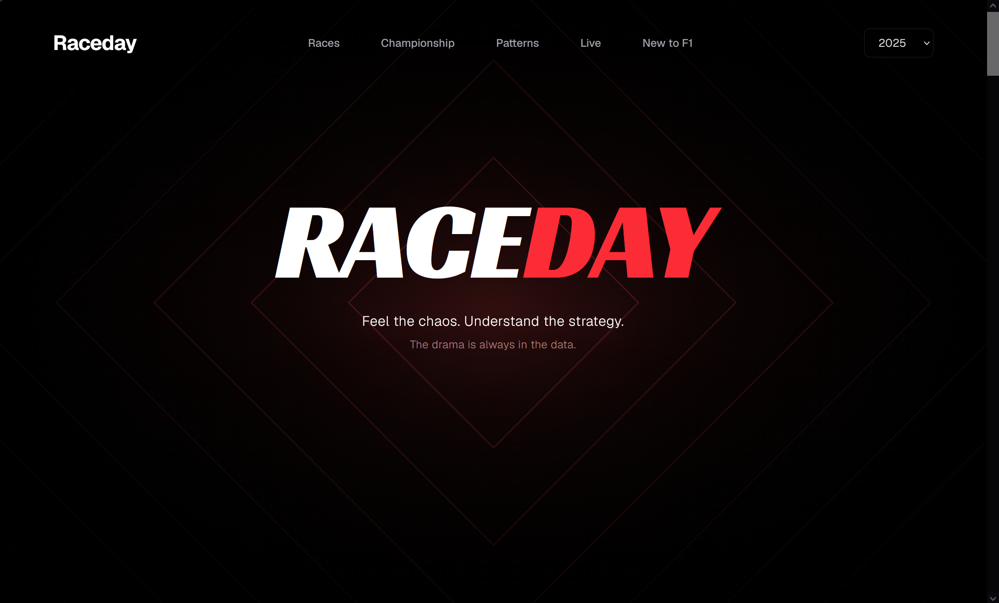
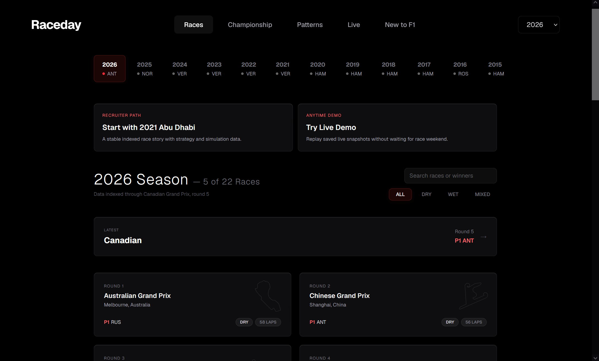
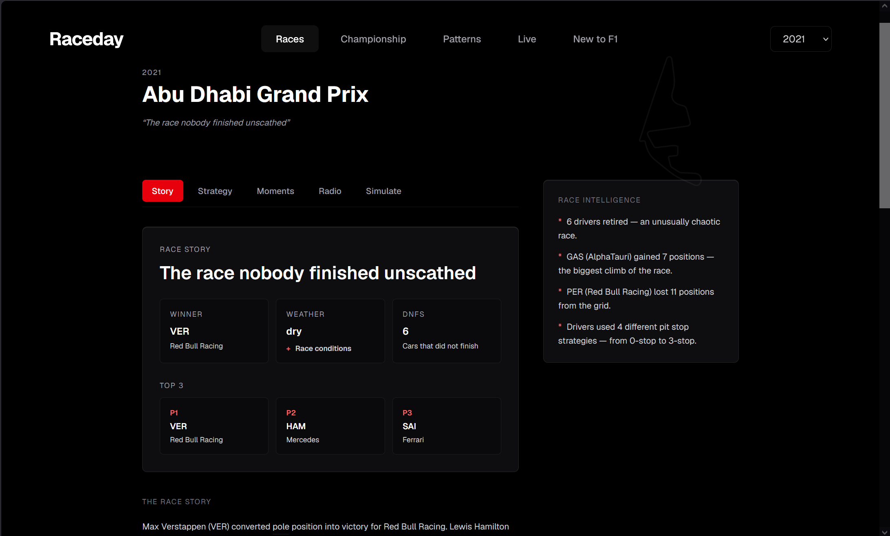
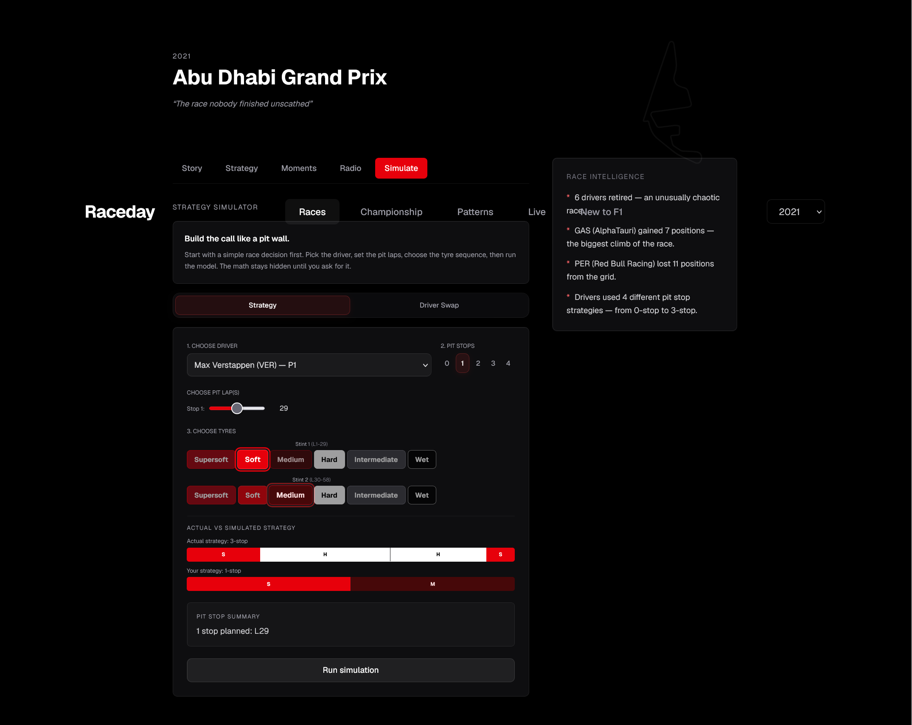
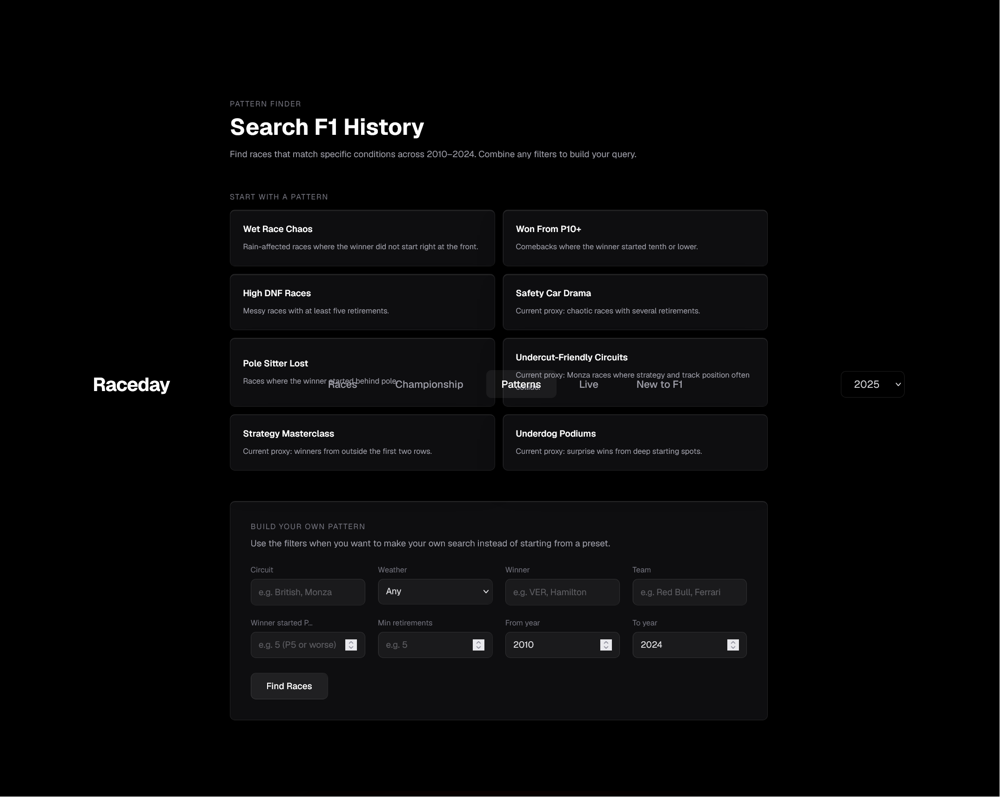
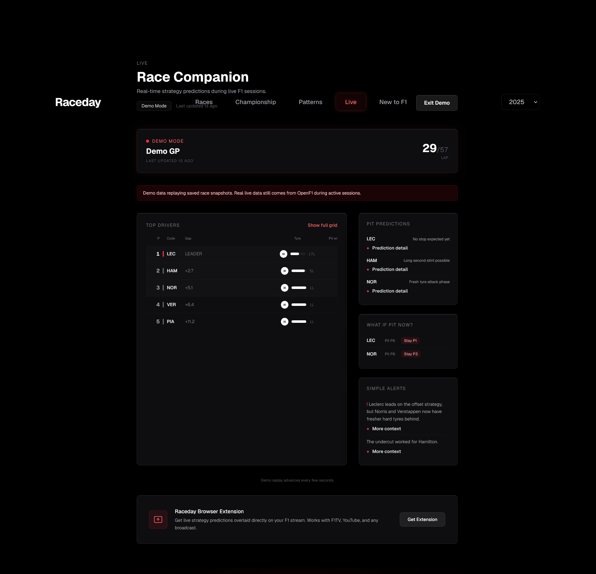
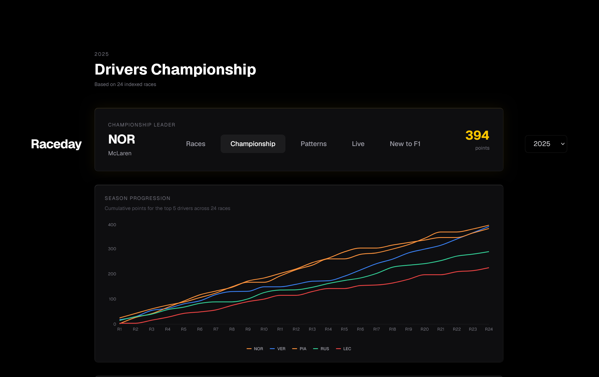
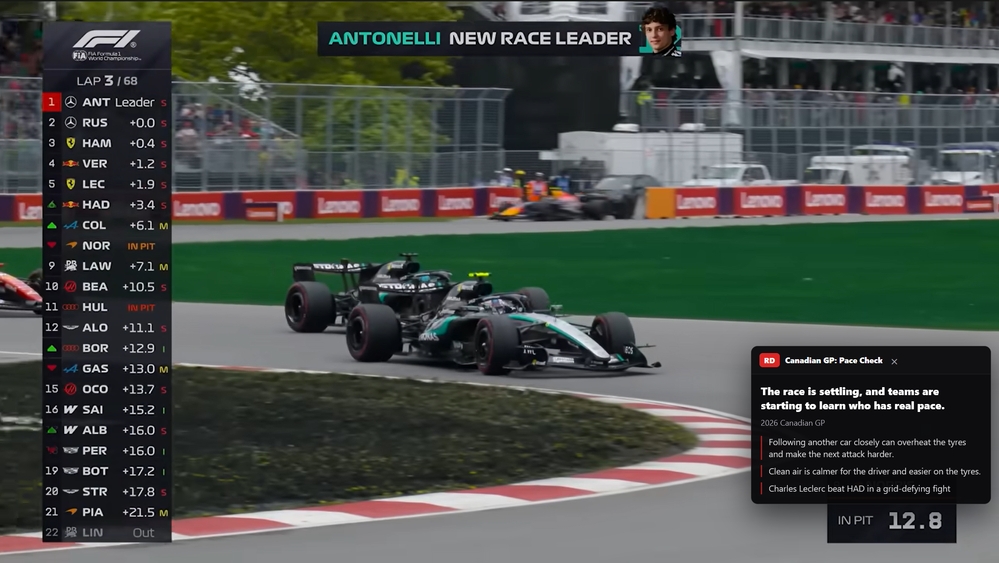

# RaceDay

RaceDay is a full-stack Formula 1 companion platform that turns historical and live race data into clean race stories, strategy insights, championship views, and interactive what-if simulations.

## What It Does

RaceDay helps fans explore Formula 1 through race breakdowns, strategy tools, championship history, live telemetry, and beginner-friendly storytelling.

It is built for both new fans who want the sport explained clearly and serious F1 fans who want deeper context without clutter, confusion, or ad-heavy pages.

Core features:

- Race-by-race breakdowns from 2010 onward
- Championship standings and points progression
- Strategy simulator for alternate pit stop scenarios
- Historical pattern finder for similar races and conditions
- Live race monitor using real-time session data
- Browser extension for simple strategy notes on F1 videos and live sessions
- Beginner-friendly explanations alongside deeper analytics

## Why I Built It

I built RaceDay as an F1 fan platform for both beginners and hardcore knowledge fans.

Formula 1 is full of strategy, data, emotion, and split-second decisions, but it can be hard to understand what is actually happening during a race. New fans often get lost in tyre strategy, pit windows, team orders, weather changes, and championship math. Experienced fans want deeper context, but most existing experiences are either too fragmented, too technical, or overloaded with noise and ads.

RaceDay is meant to make the sport easier and more exciting to follow: no confusion, no clutter, no endless ads, just the thrill of the race explained through clean data, interactive tools, and storytelling.

## Product Direction

RaceDay is designed around story-first analytics: simple race explanations first, deeper data only when the user wants it.

The goal is to make F1 easier to follow without overwhelming users with dense tables, cluttered pages, or disconnected data sources.

## Current Status

- Frontend is deployed on Vercel.
- Backend supports local and hosted deployment.
- Historical race browsing, strategy views, championship views, and pattern search are implemented.
- Live race data depends on active OpenF1 session availability.
- Demo replay mode is planned so the live companion can be shown outside race weekends.

## Architecture

```text
FastF1 / Jolpica / OpenMeteo / OpenF1
        |
        v
Python loaders + normalizers
        |
        v
JSON index / cached race data
        |
        v
FastAPI backend
        |
        v
Next.js frontend + extension
```

RaceDay is split into three main parts:

- **Backend**: FastAPI service that loads, normalizes, indexes, and serves race data.
- **Frontend**: Next.js application for race browsing, storytelling, championship views, live monitoring, and strategy tools.
- **Extension**: RaceDay Companion browser extension that shows simple strategy notes on top of live races, replays, and highlight videos.

## Data Pipeline

RaceDay combines multiple motorsport data sources and normalizes them into a consistent backend format.

| Source | Purpose |
|--------|---------|
| FastF1 | Historical timing, lap, session, tyre, and race data |
| Jolpica | Older historical race and result data where FastF1 coverage is limited |
| OpenMeteo | Weather context for race conditions |
| OpenF1 | Live race/session data for real-time updates |

The backend loaders fetch raw data, clean it, normalize field names, and store indexed JSON files. This keeps the frontend fast because most pages read from cached race data instead of repeatedly calling upstream providers.

The indexing layer supports:

- season summaries
- race schedules
- race results
- pit strategy data
- key moments
- championship standings
- progression charts
- pattern search data
- live race snapshots

## Live Race Updates

Live race updates are powered by the backend live feed service.

The backend polls OpenF1 for current session data, normalizes the response, and exposes it in two ways:

| Interface | Purpose |
|-----------|---------|
| `GET /live` | Returns the current live race state for polling clients |
| `WS /ws/live` | Streams live updates to connected clients |

The frontend live dashboard polls the backend and updates the race companion view with current driver positions, tyre data, stint age, pit windows, predictions, and pattern alerts.

The browser extension can use the same backend context as the web app, then display beginner-friendly strategy notes while a user watches a live race, replay, or highlight video elsewhere.

## Browser Extension

RaceDay Companion is the extension layer for watching F1 with context on top of the video.

It is designed to feel like a small race companion, not a technical dashboard. The extension detects supported F1 video pages, shows a draggable note card, and explains race pressure in plain language: who is under pressure, who may pit soon, who has tyre advantage, and why the moment matters.

Current extension behavior:

- Works as an overlay on supported F1 video and replay pages.
- Supports live mode and demo mode from the same simple popup.
- Uses RaceDay race context when available, but keeps the visible notes short and beginner-friendly.
- Can be closed from the overlay without opening the popup.
- Provides downloadable builds for Edge/Chrome and Firefox.

Download builds:

| Browser | File |
|---------|------|
| Edge / Chrome | [`frontend/public/downloads/raceday-extension.zip`](frontend/public/downloads/raceday-extension.zip) |
| Firefox | [`frontend/public/downloads/raceday-extension-firefox.zip`](frontend/public/downloads/raceday-extension-firefox.zip) |

The live app also exposes these downloads from the Live Companion page through the **Get Extension** menu.

## Strategy Simulator

The strategy simulator lets users test alternate pit stop plans for a selected driver and race.

It uses indexed race data, lap data, tyre compounds, stint lengths, and race-specific performance patterns to estimate how a changed strategy might affect the result.

The simulator considers:

- selected driver
- race year and track
- pit stop laps
- tyre compound sequence
- historical stint behavior
- lap and degradation patterns
- race context from indexed data

The goal is not to perfectly recreate a Formula 1 team simulator. It is designed as an explainable fan tool that shows how strategy decisions can change race outcomes and helps users understand why pit timing, tyre choice, and stint length matter.

## API Endpoints

| Method | Endpoint | Description |
|--------|----------|-------------|
| GET | `/health` | Backend health check |
| GET | `/indexing/status` | Current background indexing status |
| POST | `/refresh/{year}` | Manually refresh indexed data for a season |
| GET | `/seasons/summary` | Season summaries with champion and race metadata |
| GET | `/races/{year}` | Race calendar and indexed race status for a season |
| GET | `/races/{year}/{track}/results` | Race result summary |
| GET | `/races/{year}/{track}/strategy` | Pit stop and tyre strategy breakdown |
| GET | `/races/{year}/{track}/strategy/narrative` | Strategy explanation for a race |
| GET | `/races/{year}/{track}/strategy/stats` | Strategy statistics for a race |
| GET | `/races/{year}/{track}/moments` | Key race moments |
| GET | `/races/{year}/{track}/season-story` | Season context around a race |
| GET | `/races/{year}/{track}/sidebar` | Supporting race facts and context |
| GET | `/races/{year}/{track}/story` | Race story and tagline |
| GET | `/races/{year}/{track}/radio` | Radio clips and transcripts when available |
| GET | `/races/{year}/{track}/sim-context` | Data needed by the strategy simulator |
| POST | `/races/{year}/{track}/simulate` | Run a pit strategy simulation |
| GET | `/races/{year}/{track}/swap-context` | Driver/team swap simulation context |
| POST | `/races/{year}/{track}/simulate-swap` | Simulate a driver in another team context |
| GET | `/races/{year}/{track}/precedents` | Similar historical race precedents |
| POST | `/patterns/search` | Search historical races by conditions and filters |
| GET | `/seasons/{year}/insights` | Season-level insights |
| GET | `/championship/{year}/drivers` | Driver championship standings |
| GET | `/championship/{year}/progression` | Championship points progression |
| GET | `/live` | Current live race state |
| WS | `/ws/live` | Live race WebSocket stream |
| GET | `/debug/transcription` | Radio transcription backend status |

## Screenshots

<table>
  <tr>
    <td><strong>Home Hero</strong></td>
    <td><strong>Race Browser</strong></td>
  </tr>
  <tr>
    <td></td>
    <td></td>
  </tr>
  <tr>
    <td><strong>Race Story</strong></td>
    <td><strong>Strategy Simulator</strong></td>
  </tr>
  <tr>
    <td></td>
    <td></td>
  </tr>
  <tr>
    <td><strong>Pattern Finder</strong></td>
    <td><strong>Live Companion</strong></td>
  </tr>
  <tr>
    <td></td>
    <td></td>
  </tr>
  <tr>
    <td><strong>Championship Tracker</strong></td>
    <td><strong>Browser Extension</strong></td>
  </tr>
  <tr>
    <td></td>
    <td></td>
  </tr>
</table>

## Demo

Live app: https://raceday-khaki.vercel.app/

Video walkthrough: https://www.loom.com/share/7df534de3e6848f094580612fe1341e7

## Best Demo Path

1. Open the live app.
2. Explore a completed race from the race browser.
3. Open the race story and strategy sections.
4. Try the strategy simulator.
5. Watch the Loom walkthrough for the live companion and extension flow.

## Tech Stack

| Layer | Stack |
|-------|-------|
| Frontend | Next.js 16, React 19, TypeScript, Tailwind CSS 4, GSAP, Recharts |
| Backend | Python 3.11, FastAPI, Uvicorn |
| Data Sources | FastF1, Jolpica, OpenMeteo, OpenF1 |
| Storage | JSON index and cached race data |
| Live Updates | REST polling and WebSocket endpoint |
| Extension | Edge/Chrome and Firefox browser extension, React, Vite |
| Deployment | Vercel frontend, Railway/Docker backend |

## Local Setup

### Prerequisites

- Node.js 18+
- Python 3.11+
- npm
- pip

### Backend

```bash
cd backend
pip install -r requirements.txt
python -c "import uvicorn; uvicorn.run('backend.api:app', host='0.0.0.0', port=8888)"
```

The backend runs on:

```text
http://localhost:8888
```

On startup, it begins indexing race data in the background.

### Frontend

```bash
cd frontend
npm install
npm run dev
```

The frontend runs on:

```text
http://localhost:3000
```

By default, the frontend connects to:

```text
http://localhost:8888
```

For production, set:

```text
NEXT_PUBLIC_API_URL=<your-backend-url>
```

### Browser Extension

```bash
cd extension
npm install
npm run build
```

For local development, load the generated `extension/dist` folder as an unpacked extension.

For the production ZIP downloads:

- Edge / Chrome: download `raceday-extension.zip`, unzip it, open `chrome://extensions` or `edge://extensions`, turn on Developer mode, and load the unzipped folder.
- Firefox: download `raceday-extension-firefox.zip`, unzip it, open `about:debugging#/runtime/this-firefox`, choose **Load Temporary Add-on**, and select `manifest.json` from the unzipped folder.

## Failure Handling

RaceDay is designed to keep the user experience usable even when data sources are incomplete or temporarily unavailable.

Failure handling includes:

- cached JSON index data to avoid unnecessary repeated upstream requests
- background indexing so pages can still load existing data while new data is processed
- graceful empty states when a race, season, radio clip, or live session is unavailable
- optional radio transcription so the app still works without Groq or OpenAI keys
- API error responses for missing race data or invalid simulation inputs
- frontend loading states for slower backend calls
- live page fallback when no active session is available

Because the app depends on third-party motorsport data sources, availability can vary by season, race weekend, and provider support.

## Scaling Plan

The current architecture is designed for a project-scale deployment, but it can be expanded into a more production-grade system.

Planned scaling improvements:

- move JSON index data into a database such as Postgres or object storage-backed cache
- run indexing as scheduled jobs instead of only backend startup work
- add a queue for long-running data processing and transcription tasks
- separate live race ingestion from the public API service
- add Redis or another pub/sub layer for WebSocket fanout
- cache common API responses at the edge
- add observability for indexing failures, live feed health, and API latency
- add automated tests for core data normalization and simulation logic
- package the extension for browser store distribution where possible, while keeping direct ZIP downloads available
- add replay mode for showcasing live race behavior outside active race sessions

## Known Limitations

- Live race functionality depends on OpenF1 and session availability.
- Historical data quality varies by year and provider.
- Some pre-2018 data may have less detail than newer FastF1-supported seasons.
- Strategy simulation is an estimate, not a professional team-grade race model.
- Radio transcription depends on optional API keys or local transcription support.
- AI-generated summaries are grounded in available race data but can still require review.
- Public demo behavior depends on whether the deployed backend is healthy.

## License

All rights reserved.
